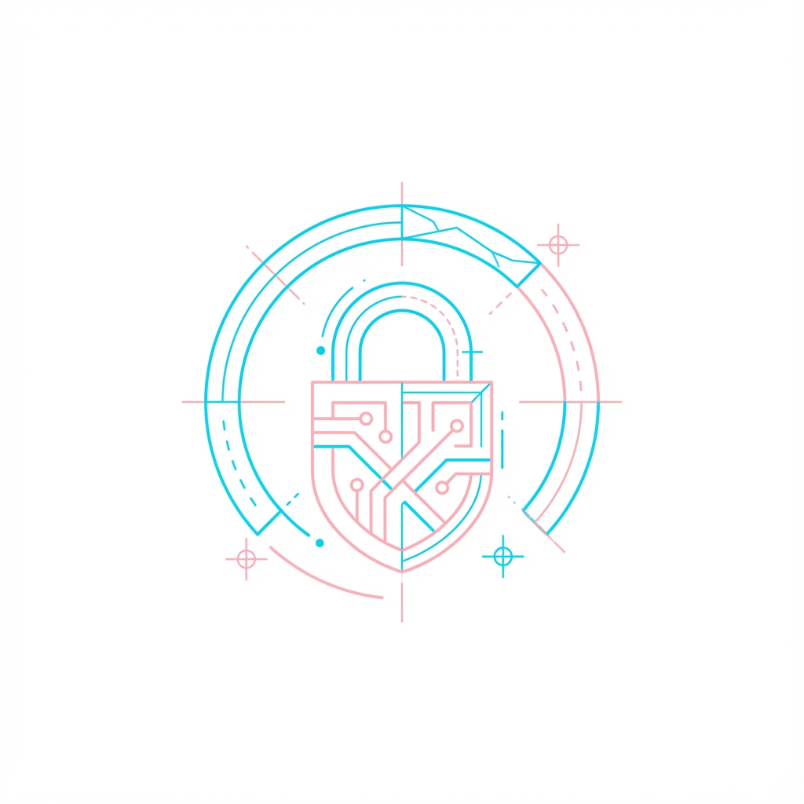

# Arc SafeWallet

<p align="center">
  
</p>

<p align="center">
  <strong>Enterprise-grade Web3 Development Platform</strong>
</p>

<p align="center">
  <a href="https://github.com/rissonwill/arc-safewallet/actions/workflows/ci.yml"></a>
  <a href="https://github.com/rissonwill/arc-safewallet/releases"></a>
  <a href="https://github.com/rissonwill/arc-safewallet/stargazers"></a>
  <a href="https://github.com/rissonwill/arc-safewallet/network/members"></a>
  <a href="https://github.com/rissonwill/arc-safewallet/issues"></a>
  <a href="LICENSE"></a>
</p>

<p align="center">
  <a href="#features">Features</a> •
  <a href="#tech-stack">Tech Stack</a> •
  <a href="#getting-started">Getting Started</a> •
  <a href="#deployment">Deployment</a> •
  <a href="#contributing">Contributing</a>
</p>

---

## Overview

Arc SafeWallet is a comprehensive Web3 development platform for building, deploying, and managing smart contracts across multiple blockchain networks. Built with security-first principles and exceptional developer experience.

## Features

### Smart Contract Development
- **Solidity Editor** — Full-featured code editor with syntax highlighting
- **Real-time Compilation** — Compile contracts using solc-js in the browser
- **Security Scanner** — Automated vulnerability detection
- **Contract Debugger** — Transaction trace analysis

### Multi-Chain Deployment
- **10+ Networks** — Ethereum, Polygon, BSC, Arbitrum, Optimism, Base, Avalanche, Arc Network
- **One-Click Deploy** — Deploy with automatic gas estimation
- **Etherscan Verification** — Integrated contract verification

### Asset Management
- **NFT Marketplace** — Create, list, and trade NFTs
- **Staking Vault** — DeFi staking with customizable APY
- **Multi-Wallet** — MetaMask, WalletConnect, Coinbase, Trust Wallet

### Governance (DAO)
- **On-chain Voting** — Create and vote on proposals
- **Timelock Controller** — Secure execution delay
- **Delegation System** — Delegate voting power

## Tech Stack

| Layer | Technology |
|-------|------------|
| Frontend | React 19, TypeScript, Tailwind CSS 4, Vite |
| Backend | Node.js, Express, tRPC |
| Database | TiDB (MySQL compatible) |
| Blockchain | ethers.js v6, Hardhat, Solidity 0.8.26 |
| Auth | OAuth 2.0, JWT |

## Getting Started

### Prerequisites

- Node.js 18+
- pnpm 8+

### Installation

```bash
git clone https://github.com/rissonwill/arc-safewallet.git
cd arc-safewallet
pnpm install
cp .env.example .env
pnpm db:push
pnpm dev
```

## Deployment

### Deployed Contracts

**Ethereum Sepolia**
| Contract | Address |
|----------|---------|
| ArcToken | `0x8A791620dd6260079BF849Dc5567aDC3F2FdC318` |
| ArcNFT | `0x610178dA211FEF7D417bC0e6FeD39F05609AD788` |
| ArcMarketplace | `0xB7f8BC63BbcaD18155201308C8f3540b07f84F5e` |
| ArcVault | `0xA51c1fc2f0D1a1b8494Ed1FE312d7C3a78Ed91C0` |
| ArcGovernance | `0x693405999755d7Fea40D635ddE861AAc462EC1f8` |
| ArcTimelock | `0x3A0671E9E966213D3d73ed1841E33879B37146fe` |

**Arc Network Testnet**
| Contract | Address |
|----------|---------|
| ArcToken | `0x7D54337E4AA62fbccf6061315F68e4Bc29EBea5D` |
| ArcNFT | `0x0656B33CFfB2c6c46c06664E86DCD268e2d42DcC` |
| ArcMarketplace | `0x5c4feae8C6CA8A31a5feB4Fc9b3e3aeD5882CaA7` |
| ArcVault | `0x7b0d9163b451C4565d488Df49aaD76fa0bac50A2` |

### Deploy Commands

```bash
npx hardhat run scripts/deploy.mjs --network sepolia
npx hardhat run scripts/deploy.mjs --network arcTestnet
npx hardhat verify --network sepolia <CONTRACT_ADDRESS>
```

## Project Structure

```
├── client/                 # React frontend
│   ├── src/
│   │   ├── components/     # UI components
│   │   ├── pages/          # Page components
│   │   ├── hooks/          # Custom hooks
│   │   └── i18n/           # Internationalization
├── server/                 # Express backend
│   ├── routers.ts          # tRPC procedures
│   └── db.ts               # Database queries
├── contracts/              # Solidity contracts
├── drizzle/                # Database schema
└── scripts/                # Deploy scripts
```

## Testing

```bash
pnpm test
```

46 tests passing.

## Contributing

1. Fork the repository
2. Create feature branch (`git checkout -b feature/new-feature`)
3. Commit changes (`git commit -m 'feat: add new feature'`)
4. Push to branch (`git push origin feature/new-feature`)
5. Open Pull Request

## License

MIT License - see [LICENSE](LICENSE) for details.

## Links

- [Documentation](DOCS.md)
- [Discord Arc](https://discord.gg/buildonarc)
- [Discord Circle](https://discord.gg/buildoncircle)
- [Twitter](https://twitter.com/smartcript)

---

<p align="center">Built by <a href="https://twitter.com/smartcript">@smartcript</a></p>
